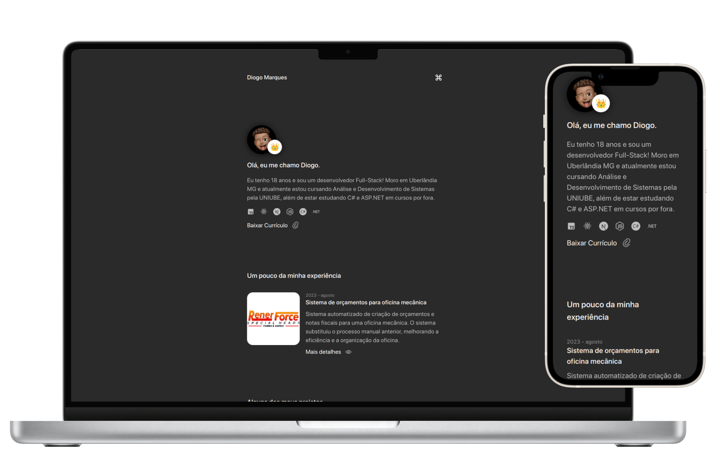

<p align="center">
   
</p>

<h1 align="center">DiogoAMV</h1>

<h3 align="center">
  :rocket: Meu portfólio pessoal. 🚀
</h3>


# :computer: Tecnologias

Este projeto foi feito utilizando as seguintes tecnologias:

Front-end:
* [clsx](https://github.com/lukeed/clsx)
* [framer-motion](https://www.framer.com/motion/)
* [Next.js](https://nextjs.org/)
* [Tailwind CSS](https://tailwindcss.com/)
* [tailwind-merge](https://github.com/benface/tailwind-merge)
* [react-icons](https://react-icons.github.io/react-icons/)
* [react-markdown](https://github.com/remarkjs/react-markdown)
* [react-hotkeys-hook](https://github.com/JohannesKlauss/react-hotkeys-hook)
* [react-fast-marquee](https://github.com/lijinke666/react-fast-marquee)
* [TypeScript](https://www.typescriptlang.org/)

## Como Iniciar?

### Requisitos

- [Node.js](https://nodejs.org/en/)
- [Yarn](https://classic.yarnpkg.com/) ou [npm](https://www.npmjs.com/package/npm)

**Clone o projeto e acesse a pasta**

```bash
git clone https://github.com/DiogoAMV/my-portfolio.git && cd my-portfolio
```

**Siga os passos abaixo**

```bash
# Na pasta raiz do projeto, acesse a pasta 'web'
$ cd web
# Instale as dependências
$ npm install
# Inicie a aplicação
$ npm run dev
```

## :memo: Licença

Esse projeto está sob a licença MIT. Veja o arquivo [LICENSE](LICENSE.md) para mais detalhes.

---

Feito com :purple_heart: by [Diogo Marques](https://github.com/DiogoAMV)

[](https://www.linkedin.com/in/diogo-amv/) 
[](mailto:diogo.amv19@gmail.com)
